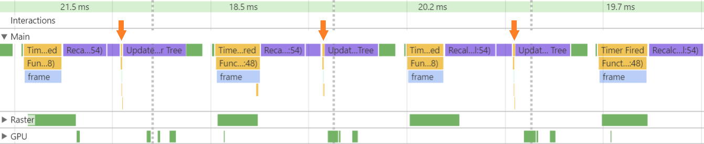

# About
A minimally invasive raf/fps meter.


# How it works
A requestAnimationFrame is scheduled to run as fast as possible and the time between two such calls is measured and stored in a short buffer. From time to time the mean duration is calculated and displayed at the top of the page.

In case the application being benchmarked is scheduling its own requestAnimationFrame(s) then there is no need to change them or merge with the instrumentation code because the browser will run all them.


# Setup
Just add this line to the page:
```html
<script type="text/javascript" src="rafmeter.js" ></script>
```

# Examples
https://rawgit.com/cristiingineru/rafmeter/master/test1.html
https://rawgit.com/cristiingineru/rafmeter/master/test2.html
https://rawgit.com/cristiingineru/rafmeter/master/test3.html


# Impact on performance
The instrumentation is taking up to 0.25 ms which for an ideally fluent page running at 60 fps means 1.5%. The slower the page the smaller the impact of the instrumentation.



# Bulk
Lots of pages to be benchmarked? Add instrumentation to all of them with [rafmeter-injector](https://github.com/cristiingineru/rafmeter-injector)
